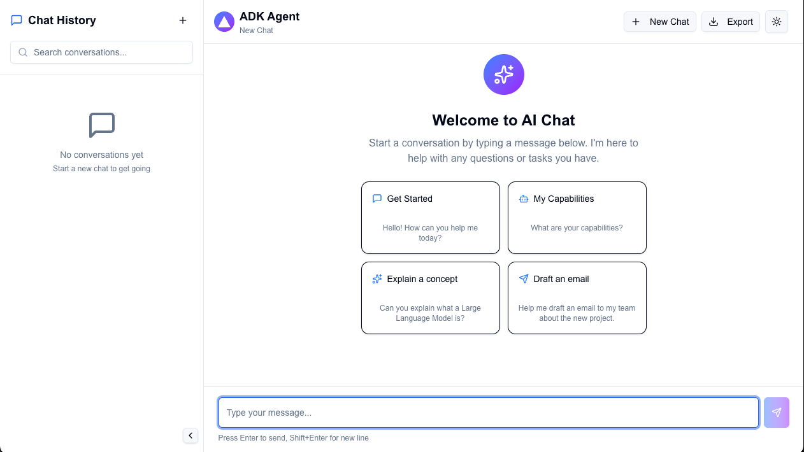

# ADK Agent Frontend

This is a Next.js application that provides a chatbot user interface for interacting with agents built with the **Agent Development Kit (ADK)**. It is designed to connect to ADK agents running on various Google Cloud platforms, including **Vertex AI Agent Engine**, **Google Kubernetes Engine (GKE)**, and **Cloud Run**.

## Features

- **Chat Interface:** A clean, modern chat interface for sending and receiving messages from your ADK agent.
- **Session Management:** Support for multiple chat sessions, with history saved in the browser's local storage (not ADK Session Manager at the moment).
- **Configurable Backend:** Easily configure the application to connect to your ADK agent's endpoint.
- **Customizable UI:** Customize the application title and logo to match your agent's branding.
- **Suggested Questions:** Provide users with a set of pre-filled questions to get them started.
- **Easy Deployment:** Deploy the application to Google Cloud Run using the provided Cloud Build configuration.

## Screenshot



## Configuration

Create a `.env` file in the root of the project and add the following variables.

### Frontend Configuration

These variables are used in the browser and must be prefixed with `NEXT_PUBLIC_`.

```
# The title of the application
NEXT_PUBLIC_APP_TITLE="ADK Agent"

# The path to the application logo
NEXT_PUBLIC_LOGO_PATH=/vercel.svg
```

### Backend Configuration

These variables are used on the server and should not be exposed to the browser.

```
# The endpoint of the ADK server
ADK_SERVER_ENDPOINT=http://127.0.0.1:8000

# The name of the ADK application
ADK_APP_NAME=agent_name
```

### Suggested Questions

You can customize the suggested questions that appear on the welcome screen by editing the `public/suggested-questions.json` file. This file contains a JSON array of question objects. Each object must have the following properties:

- `title`: A short, descriptive title for the question.
- `question`: The full question to be sent to the agent.
- `icon`: The name of an icon from the [lucide-react](https://lucide.dev/) library to be displayed next to the question.

Here is an example of the `public/suggested-questions.json` file format:

```json
[
  {
    "title": "Get Started",
    "question": "Hello! How can you help me today?",
    "icon": "MessageSquare"
  },
  {
    "title": "My Capabilities",
    "question": "What are your capabilities?",
    "icon": "Bot"
  },
  {
    "title": "Explain a concept",
    "question": "Can you explain what a Large Language Model is?",
    "icon": "Sparkles"
  },
  {
    "title": "Draft an email",
    "question": "Help me draft an email to my team about the new project.",
    "icon": "Send"
  }
]
```

## Getting Started

First, install the dependencies:

```bash
npm install
```

Then, run the development server:

```bash
npm run dev
# or
yarn dev
# or
pnpm dev
# or
bun dev
```

Open [http://localhost:3000](http://localhost:3000) with your browser to see the result.

You can start editing the page by modifying `app/page.tsx`. The page auto-updates as you edit the file.

This project uses [`next/font`](https://nextjs.org/docs/app/building-your-application/optimizing/fonts) to automatically optimize and load [Geist](https://vercel.com/font), a new font family for Vercel.

## Git Hooks

This project uses [husky](https://typicode.github.io/husky/) to manage Git hooks.

### Pre-commit

A `pre-commit` hook is configured to run `npm run build` before each commit. This ensures that the project builds successfully and prevents committing broken code.

### Pre-push

A `pre-push` hook is configured to run `npm run test` before pushing to the repository. This ensures that all tests pass before sharing your code.

## Learn More

To learn more about Next.js, take a look at the following resources:

- [Next.js Documentation](https://nextjs.org/docs) - learn about Next.js features and API.
- [Learn Next.js](https://nextjs.org/learn) - an interactive Next.js tutorial.

You can check out [the Next.js GitHub repository](https://github.com/vercel/next.js) - your feedback and contributions are welcome!

## Contributing

Contributions are welcome! Please see the `LICENSE` file for more details.

## License

This project is licensed under the Apache License 2.0. See the `LICENSE` file for details.

## Authentication

This application does not manage user authentication. It is a public-facing application by default. If you need to restrict access when deploying to Google Cloud Run or GKE, it is recommended to use [Identity-Aware Proxy (IAP)](https://cloud.google.com/iap) to secure your application.

### Service-to-Service Authentication

This application does not manage any authentication to the ADK Agent. This means that the Service Account used by the Cloud Run service hosting this frontend must have the right permissions to access the remote ADK Agent.

#### Cloud Run to Cloud Run

If you are deploying both the frontend and the ADK agent as Cloud Run services, you can follow these steps to set up authentication:

1.  **Create a dedicated Service Account** for the frontend service to use.

    ```bash
    gcloud iam service-accounts create adk-frontend-sa \
        --display-name "ADK Frontend Service Account"
    ```

2.  **Grant the `roles/run.invoker` role** to the frontend's Service Account on the ADK agent's Cloud Run service. This will allow the frontend to invoke the agent.

    ```bash
    gcloud run services add-iam-policy-binding adk-agent-service \
        --member="serviceAccount:adk-frontend-sa@<PROJECT_ID>.iam.gserviceaccount.com" \
        --role="roles/run.invoker"
    ```

3.  **Deploy the frontend service** with the dedicated Service Account.
    ```bash
    gcloud run deploy frontend-service \
        --image <IMAGE_URL> \
        --service-account adk-frontend-sa@<PROJECT_ID>.iam.gserviceaccount.com
    ```

## Deploy on Google Cloud

This project is configured for deployment to Google Cloud Run using Cloud Build.

### Prerequisites

1.  A Google Cloud project with billing enabled.
2.  The `gcloud` CLI installed and authenticated.
3.  APIs enabled for Cloud Build, Cloud Run, and Artifact Registry.

### Deployment

1.  **Set up a Cloud Build trigger:**

    - Connect your Git repository to Cloud Build.
    - Create a trigger that uses the `cloudbuild.yaml` file.
    - Configure the following substitution variables in the trigger:
      - `_GCR_HOSTNAME`: The Artifact Registry hostname (e.g., `us-central1-docker.pkg.dev`).
      - `_SERVICE_NAME`: The name of your Cloud Run service.
      - `_DEPLOY_REGION`: The region to deploy to (e.g., `us-central1`).
      - `_ADK_SERVER_ENDPOINT`: The endpoint of your ADK server.
      - `_ADK_APP_NAME`: The name of your ADK application.
      - `_NEXT_PUBLIC_APP_TITLE`: The title of your application.
      - `_NEXT_PUBLIC_LOGO_PATH`: The path to your application logo.

2.  **Push to your repository:**
    - Commit and push your changes to the branch connected to the trigger.
    - Cloud Build will automatically build and deploy your application.
